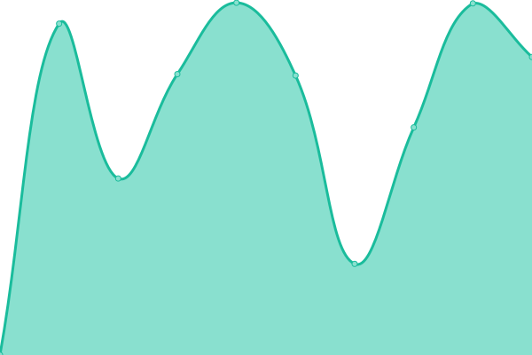
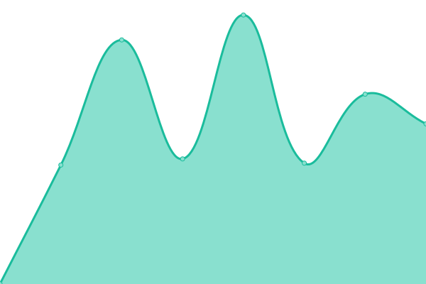

# [📈 Live Status](https://einvasion-id.github.io/status): <!--live status--> **🟩 All systems operational**

This repository contains the open-source uptime monitor and status page for [E-Invasion Cabang Indonesia](https://einvasion-id.github.io/status), powered by [Upptime](https://github.com/upptime/upptime).

With [Upptime](https://upptime.js.org), you can get your own unlimited and free uptime monitor and status page, powered entirely by a GitHub repository. We use [Issues](https://github.com/einvasion-id/status/issues) as incident reports, [Actions](https://github.com/einvasion-id/status/actions) as uptime monitors, and [Pages](https://einvasion-id.github.io/status) for the status page.

<!--start: status pages-->
<!-- This summary is generated by Upptime (https://github.com/upptime/upptime) -->
<!-- Do not edit this manually, your changes will be overwritten -->
<!-- prettier-ignore -->
| URL | Status | History | Response Time | Uptime |
| --- | ------ | ------- | ------------- | ------ |
|  [E-Invasion](https://e-invasion.com) | 🟩 Up | [e-invasion.yml](https://github.com/einvasion-id/status/commits/HEAD/history/e-invasion.yml) | 

 511ms
     
 | 

<a href="https://einvasion-id.github.io/status/history/e-invasion">100.00%</a>
    

|  [Babyplan.com](https://babyplan.com) | 🟩 Up | [babyplan-com.yml](https://github.com/einvasion-id/status/commits/HEAD/history/babyplan-com.yml) | 

 677ms
     
 | 

<a href="https://einvasion-id.github.io/status/history/babyplan-com">98.73%</a>
    

|  [Babyplan.dk](https://babyplan.dk) | 🟩 Up | [babyplan-dk.yml](https://github.com/einvasion-id/status/commits/HEAD/history/babyplan-dk.yml) | 

 1248ms
     
 | 

<a href="https://einvasion-id.github.io/status/history/babyplan-dk">98.73%</a>
    

|  [Babyplan.se](https://babyplan.se) | 🟩 Up | [babyplan-se.yml](https://github.com/einvasion-id/status/commits/HEAD/history/babyplan-se.yml) | 

 774ms
     
 | 

<a href="https://einvasion-id.github.io/status/history/babyplan-se">98.73%</a>
    

|  [Babyplan.no](https://babyplan.no) | 🟩 Up | [babyplan-no.yml](https://github.com/einvasion-id/status/commits/HEAD/history/babyplan-no.yml) | 

 847ms
     
 | 

<a href="https://einvasion-id.github.io/status/history/babyplan-no">98.73%</a>
    

|  [Billige-Teste.dk](https://billige-teste.dk) | 🟩 Up | [billige-teste-dk.yml](https://github.com/einvasion-id/status/commits/HEAD/history/billige-teste-dk.yml) | 

 1404ms
     
 | 

<a href="https://einvasion-id.github.io/status/history/billige-teste-dk">98.74%</a>
    

|  [Billiga-Tester.se](https://billiga-tester.se) | 🟩 Up | [billiga-tester-se.yml](https://github.com/einvasion-id/status/commits/HEAD/history/billiga-tester-se.yml) | 

 1239ms
     
 | 

<a href="https://einvasion-id.github.io/status/history/billiga-tester-se">98.74%</a>
    

|  [Billige-Tester.no](https://billige-tester.no) | 🟩 Up | [billige-tester-no.yml](https://github.com/einvasion-id/status/commits/HEAD/history/billige-tester-no.yml) | 

 1342ms
     
 | 

<a href="https://einvasion-id.github.io/status/history/billige-tester-no">98.74%</a>
    

|  [Clearblueshop.dk](https://clearblueshop.dk) | 🟩 Up | [clearblueshop-dk.yml](https://github.com/einvasion-id/status/commits/HEAD/history/clearblueshop-dk.yml) | 

 718ms
     
 | 

<a href="https://einvasion-id.github.io/status/history/clearblueshop-dk">98.74%</a>
    

|  [Clearblueshop.se](https://clearblueshop.se) | 🟩 Up | [clearblueshop-se.yml](https://github.com/einvasion-id/status/commits/HEAD/history/clearblueshop-se.yml) | 

 891ms
     
 | 

<a href="https://einvasion-id.github.io/status/history/clearblueshop-se">98.74%</a>
    

|  [Clearblueshop.no](https://clearblueshop.no) | 🟩 Up | [clearblueshop-no.yml](https://github.com/einvasion-id/status/commits/HEAD/history/clearblueshop-no.yml) | 

 904ms
     
 | 

<a href="https://einvasion-id.github.io/status/history/clearblueshop-no">98.75%</a>
    

<!--end: status pages-->

[**Visit our status website →**](https://einvasion-id.github.io/status)

## 📄 License

- Powered by: [Upptime](https://github.com/upptime/upptime)
- Code: [MIT](./LICENSE) © [Anand Chowdhary](https://anandchowdhary.com), supported by [Pabio](https://pabio.com)
- Data in the `./history` directory: [Open Database License](https://opendatacommons.org/licenses/odbl/1-0/)
